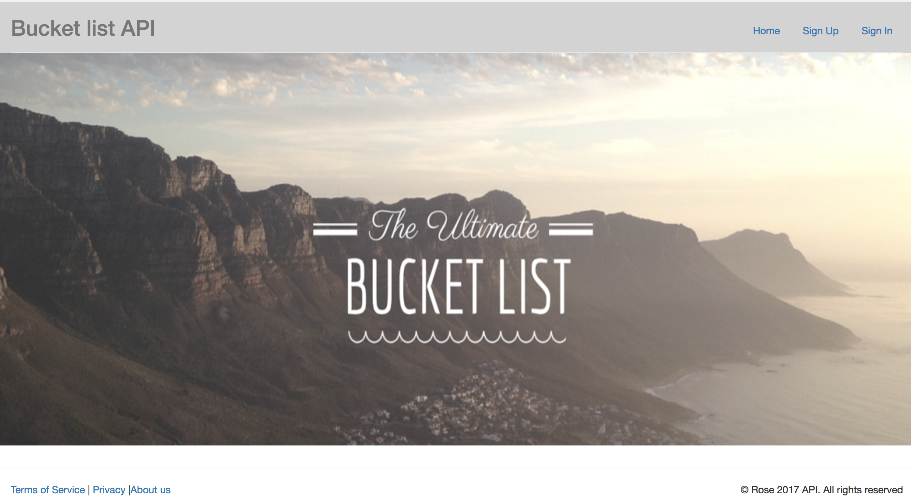
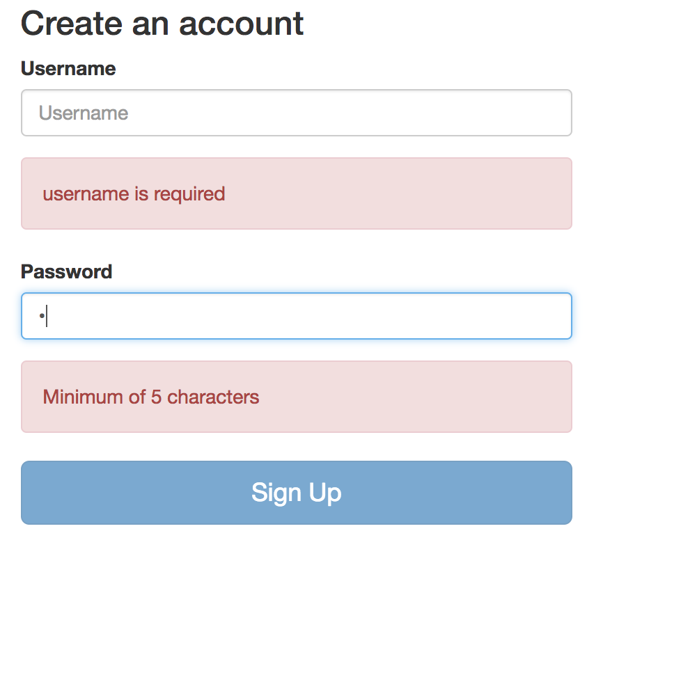
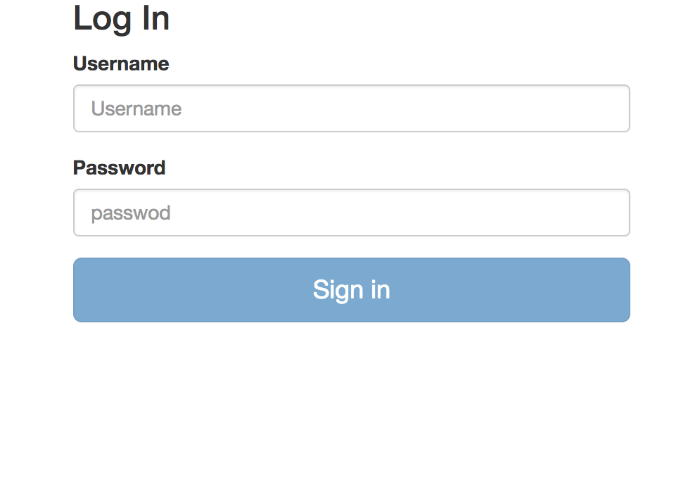
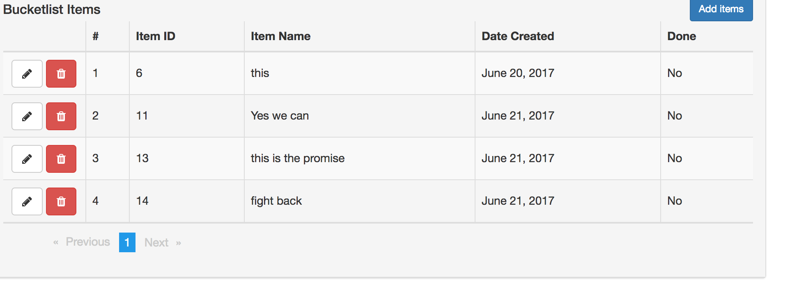

# Bucketlistfront

This project was generated with [angular-cli](https://github.com/angular/angular-cli) version 1.0.0-beta.28.3.

### Installation and setup
Clone the repo 

```
https://github.com/r-wambui/Bucketlist_frontend.git
```
Navigate to the root directory
```
cd bucketlistfront
```
Install the modules
```
npm install
```
run the server
```
ng serve 
```
### API server backend
To access the resources clone the backend repo  https://github.com/r-wambui/bucket_list/tree/work and follow the instruction on the READme file

### Sample requests
Home page 

user register

User login

Dashboard
![Screen shot]src/assets/screenshots/user_dashboard.png)


